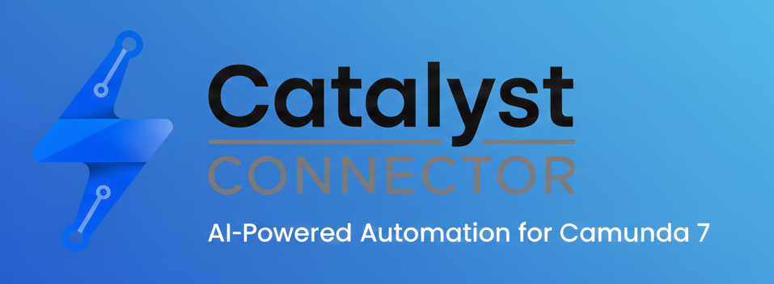
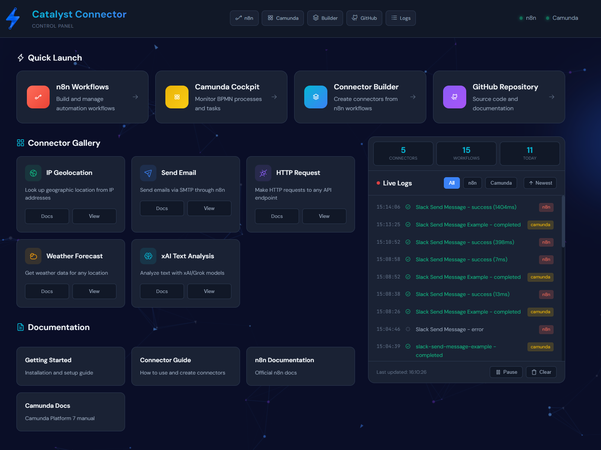
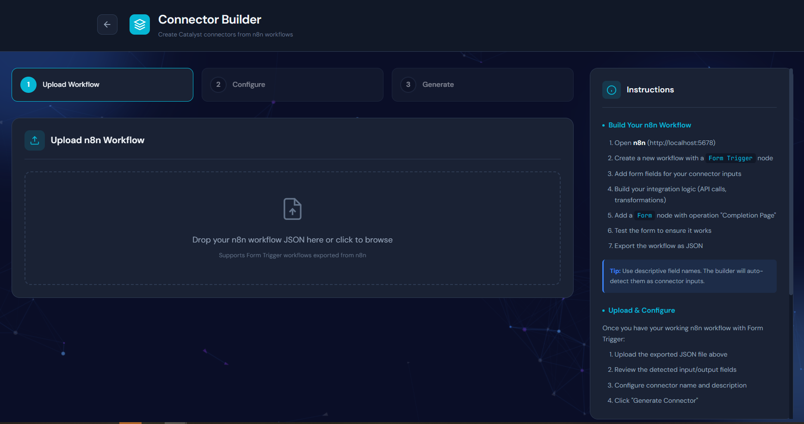

<p align="center">
  
</p>

<h1 align="center">Catalyst</h1>

<p align="center">
  <strong>Bridge Camunda 7 to n8n's 400+ integrations.<br/>One command. Full control panel. 97% less than Camunda 8.</strong>
</p>

<p align="center">
  <a href="LICENSE"></a>
  <a href="https://faircode.io"></a>
  <a href="https://github.com/AlainJaques22/catalyst/stargazers"></a>
</p>

<p align="center">
  <a href="#-quick-start">Quick Start</a> •
  <a href="#-features">Features</a> •
  <a href="#-pricing">Pricing</a> •
  <a href="#-connectors">Connectors</a> •
  <a href="#-support-this-project">Support</a>
</p>

---

## 🚀 Quick Start

**Prerequisites:** Docker

```bash
git clone https://github.com/AlainJaques22/catalyst.git
cd catalyst
docker-compose up -d
```

**Open:** [http://localhost](http://localhost)

<p align="center">
  
</p>

<p align="center"><em>That's it. Full platform running. Mind = blown.</em></p>

---

## ✨ Features

### 🎛️ Unified Control Panel

Everything you need in one place at `localhost`:

| Feature | Description |
|---------|-------------|
| **Quick Launch** | One-click access to n8n, Camunda Cockpit, Connector Builder |
| **Connector Gallery** | Browse, view, and manage all available connectors |
| **Live Logs** | Real-time execution monitoring with n8n/Camunda filtering |
| **Stats Dashboard** | Instant visibility into connectors, workflows, and daily activity |
| **Documentation** | Built-in links to all guides and references |
| **Health Status** | Live indicators showing all services are running |

### 📦 All-In-One Docker Package

One `docker-compose up` gives you:

- ✅ **Camunda 7** - BPMN process engine
- ✅ **n8n** - 400+ integrations & workflow automation
- ✅ **PostgreSQL** - Database
- ✅ **Nginx** - Reverse proxy
- ✅ **Control Panel** - The beautiful UI you see above

No installation guides. No dependency hell. No configuration headaches.

### 🔌 Growing Connector Library

Access n8n's massive ecosystem:

- **400+** official integrations
- **7,500+** workflow templates
- **Unlimited** custom API connections

---

## 🔧 Connector Builder

Build your own connectors without code. Seriously.

1. Create a workflow in n8n using any of the thousands of integrations and templates.
2. Export as JSON
3. Drop it in the Connector Builder
4. Done.



## 🎯 Why Catalyst?

### The Problem

You're on Camunda 7 and need integrations:

| Option | Pain |
|--------|------|
| **Migrate to Camunda 8** | $60,000-$94,000+/year + massive migration |
| **Build custom Java** | Months of dev work, ongoing maintenance |
| **Enterprise iPaaS** | Another $50K+ tool, more vendor lock-in |

### The Catalyst Difference

| | Camunda 8 | Catalyst |
|---|-----------|----------|
| **Setup** | Complex multi-tool install | `docker-compose up` |
| **UI** | Separate tools, no unified view | **Single Control Panel** |
| **Connectors** | 136 | **400+** (via n8n) |
| **Templates** | 43 blueprints | **7,500+** workflows |
| **Minimum Cost** | $60,000+/year | **$192/year** |
| **Pricing** | "Request a quote" | **Published, transparent** |
| **Migration** | Full C7→C8 rewrite | **Stay on Camunda 7** |

---

## 💰 Pricing

**Development is free. Production pricing is simple and transparent.**

| Tier | Annual Cost | Instances/Year | Per Instance |
|------|-------------|----------------|--------------|
| ☕ **Micro** | **$192** | 1,200 | $0.16 |
| 🚀 **Starter** | **$1,600** | 10,000 | $0.16 |
| 💼 **Professional** | **$8,000** | 50,000 | $0.16 |
| 🏢 **Enterprise** | **$16,000** | 100,000 | $0.16 |

### What You Get

- ✅ All connectors included (no per-connector fees)
- ✅ Published pricing (same for everyone)
- ✅ No sales calls required
- ✅ No negotiations
- ✅ Start small, scale as you grow

### The Savings

| Scale | Camunda 8 | Catalyst | You Save |
|-------|-----------|----------|----------|
| 10K instances/yr | $60,000-$94,000+ | $1,600 | **$58,400+** (97%) |
| 50K instances/yr | ~$300,000+ | $8,000 | **$292,000+** |
| 100K instances/yr | ~$600,000+ | $16,000 | **$584,000+** |

<p align="center"><em>"Start production automation for what you'd spend on Netflix and Spotify combined."</em></p>

---

## 🔌 Connectors

All connectors included with your subscription. No extra fees.

### Available Now

| Connector | Description |
|-----------|-------------|
| 🔌 **Ping** | Test connectivity |
| 🌍 **IP Geolocation** | Look up geographic location from IP addresses |
| 📧 **Send Email** | Send emails via SMTP through n8n |
| 🌐 **HTTP Request** | Make HTTP requests to any API endpoint |
| 🌤️ **Weather Forecast** | Get weather data for any location |
| 🤖 **xAI Text Analysis** | Analyze text with xAI/Grok models |

### Coming Soon

| Connector | Use Case |
|-----------|----------|
| 💬 **Slack** | Send messages to channels/users |
| 📊 **Google Sheets** | Read/write spreadsheet data |
| 🤖 **OpenAI** | AI-powered automation |
| 🏢 **Salesforce** | CRM integration |

### Want More?

With n8n under the hood, you have access to **400+ integrations** out of the box. Plus you can connect to any REST API using the HTTP Request connector.

[Request a connector](https://github.com/AlainJaques22/catalyst/issues/new) →

---

## 🏗️ Architecture

```
┌─────────────────────────────────────────────────────────────────┐
│                    http://localhost                              │
│                   Catalyst Control Panel                         │
├─────────────────────────────────────────────────────────────────┤
│  ┌─────────────┐  ┌─────────────┐  ┌─────────────┐              │
│  │   Camunda   │  │     n8n     │  │   Nginx     │              │
│  │   Cockpit   │  │  Workflows  │  │   Proxy     │              │
│  └──────┬──────┘  └──────┬──────┘  └─────────────┘              │
│         │                │                                       │
│         ▼                ▼                                       │
│  ┌─────────────────────────────────────────────────┐            │
│  │              Catalyst Bridge                     │            │
│  │         (Routes Camunda → n8n webhooks)         │            │
│  └─────────────────────────────────────────────────┘            │
│                          │                                       │
│                          ▼                                       │
│  ┌─────────────────────────────────────────────────┐            │
│  │              PostgreSQL Database                 │            │
│  └─────────────────────────────────────────────────┘            │
└─────────────────────────────────────────────────────────────────┘
                    All inside Docker 🐳
```

---

## 📖 Documentation

| Guide | Description |
|-------|-------------|
| [Getting Started](docs/getting-started.md) | Installation and setup |
| [Connector Guide](docs/connector-guide.md) | How to use and create connectors |
| [Connector Spec](CONNECTOR_SPEC.md) | Technical specification |
| [Architecture](docs/architecture.md) | Deep dive into how it works |

---

## 🤝 Contributing

We welcome contributions! The Connector Builder in the control panel makes it easy to create new connectors from n8n workflows.

See [CONTRIBUTING.md](CONTRIBUTING.md) for details.

---

## 💖 Support This Project

Catalyst is built with love (and Claude 🤖). If you want to see it succeed, consider supporting development:

<p align="center">
  <a href="https://github.com/sponsors/AlainJaques22">
    
  </a>
  &nbsp;
  <a href="https://ko-fi.com/YOUR-KOFI">
    
  </a>
</p>

### Sponsor Tiers

| Tier | Monthly | Perks |
|------|---------|-------|
| ☕ **Supporter** | $5 | Name in README, Discord access |
| 🚀 **Backer** | $25 | + Vote on next connector, early access |
| 💎 **Sponsor** | $100 | + Logo below, priority support |
| 🏢 **Enterprise** | $500 | + 1hr/mo consulting, custom connector priority |

### Sponsors

*Your logo here — [become a sponsor](https://github.com/sponsors/AlainJaques22)*

<!-- SPONSORS:START -->
<!-- SPONSORS:END -->

### Other Ways to Help

- ⭐ **Star this repo** — helps others find us
- 📣 **Share on LinkedIn/Twitter** — spread the word
- 🐛 **Report issues** — help us improve
- 🔌 **Build a connector** — grow the ecosystem

---

## 📜 License

Catalyst is [Fair Code](https://faircode.io) licensed under [Elastic License 2.0 (ELv2)](LICENSE).

<details>
<summary><strong>What does this mean?</strong></summary>

**You CAN:**
- ✅ Self-host on your infrastructure
- ✅ Use commercially within your organization  
- ✅ Modify the source code
- ✅ Develop and test for free

**You CANNOT:**
- ❌ Offer Catalyst as a hosted service to others
- ❌ Resell Catalyst as a product

**Why Fair Code?**

Same model as n8n, Elastic, and Grafana. Keeps it accessible while protecting the project from cloud vendors reselling our work.

</details>

---

## 🗺️ Roadmap

- [x] Core bridge architecture
- [x] Control panel UI
- [x] Connector gallery
- [x] Live logs
- [x] Connector builder
- [ ] Slack connector
- [ ] Google Sheets connector
- [ ] OpenAI connector
- [ ] Usage tracking
- [ ] Self-service licensing

---

## 🙋 FAQ

<details>
<summary><strong>Is Catalyst free?</strong></summary>

Development is free. Production requires a license starting at $192/year — still 97% cheaper than Camunda 8.
</details>

<details>
<summary><strong>What do I need to install?</strong></summary>

Just Docker. Run `docker-compose up -d` and open `localhost`. Everything else is included.
</details>

<details>
<summary><strong>Do I need to migrate from Camunda 7?</strong></summary>

No! That's the whole point. Catalyst works WITH your existing Camunda 7 installation. No migration required.
</details>

<details>
<summary><strong>Where are my API credentials stored?</strong></summary>

In n8n, which runs on YOUR infrastructure. Credentials never leave your environment.
</details>

<details>
<summary><strong>Is this an official Camunda product?</strong></summary>

No. Catalyst is an independent project built for the Camunda community.
</details>

---

<p align="center">
  <strong>One command. Full platform. 97% savings.</strong><br/>
  <sub>Built with ❤️ and 🤖 for the Camunda community</sub>
</p>

<p align="center">
  <a href="https://github.com/AlainJaques22/catalyst/stargazers">⭐ Star us on GitHub</a>
</p>